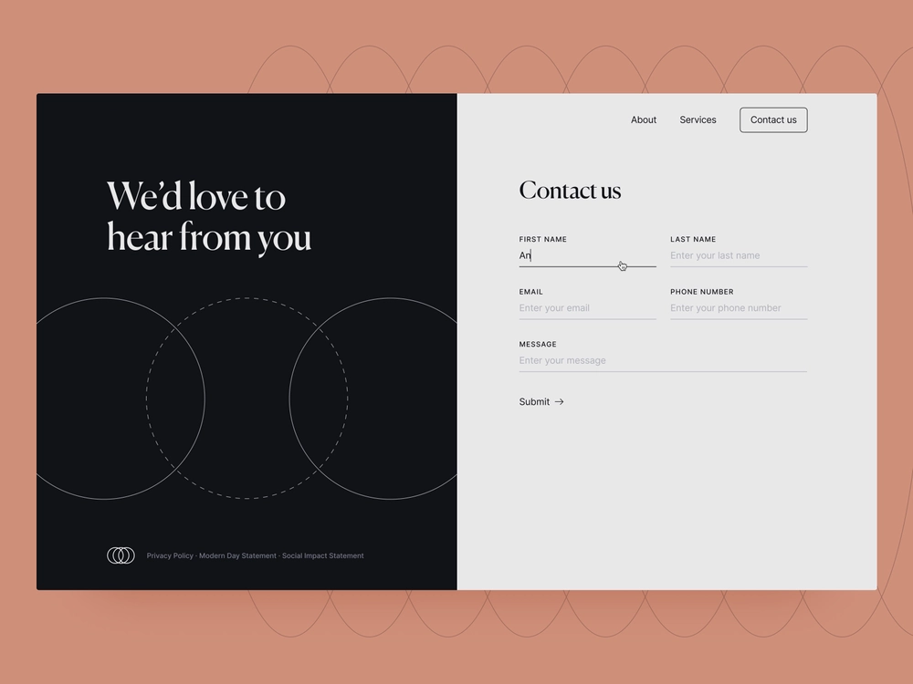

# Introducción a Forms adaptable sin encabezado

Este tutorial le proporciona un marco de trabajo completo para crear un formulario adaptable sin encabezado. El tutorial está organizado en un caso de uso y en varias guías. Cada guía le ayuda a aprender y agregar nuevas funciones al formulario adaptable que se cree en este tutorial. Después de cada guía, tendrá un formulario adaptable operativo. Al final de este tutorial, debería poder hacer lo siguiente:

* Crear un formulario adaptable sin encabezado
* Agregar reglas empresariales al formulario
* Usar la interfaz de usuario de Google Material para aplicar estilo al formulario
* Rellenar previamente el formulario
* Incrustar el formulario en una página web

También va a comprender la arquitectura, los artefactos disponibles y la estructura JSON de los formularios adaptables sin encabezado.

**El recorrido comienza con el aprendizaje del caso de uso**:

Raya Tan, miembro del Departamento de Relaciones Exteriores de un país conocido por su belleza natural y floreciente economía turística, supervisa la distribución de formularios de visa a los turistas. Estos formularios están disponibles en el sitio web del departamento, las aplicaciones móviles nativas y en formato PDF, con múltiples opciones de idioma para que los turistas elijan. Sin embargo, administrar y escalar estos formularios en diferentes plataformas y tecnologías puede ser un desafío.

Para mejorar la eficiencia y flexibilidad de su proceso de solicitud de visa, el Departamento de Relaciones Exteriores ha decidido adoptar un enfoque de formularios adaptables sin encabezado. Esta arquitectura disociada separa el front-end del back-end, lo que permite una mayor personalización y escalabilidad. El departamento tiene previsto utilizar los componentes de React de la interfaz de usuario de Google Material para mejorar la experiencia del usuario con los formularios. También va a utilizar funciones de back-end como las siguientes:

* Firmas digitales
* Integración de datos
* Administración de procesos empresariales
* Documento de registro
* Análisis de uso

La forma más popular entre los turistas es el formulario “Contacto”, que se utiliza para hacer diversas preguntas y consultas. Como tal, el Departamento de Asuntos Exteriores ha decidido empezar a aplicar el enfoque de los formularios adaptables sin encabezado con este formulario. Este tutorial le guía a través del proceso de creación del formulario Contáctenos mediante esta nueva arquitectura. El resultado final tiene este aspecto:

