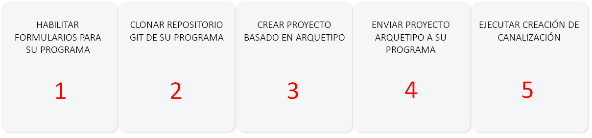
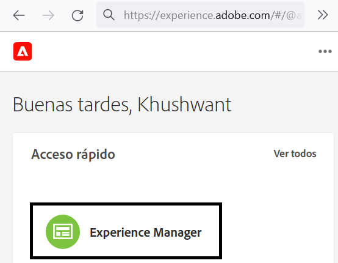
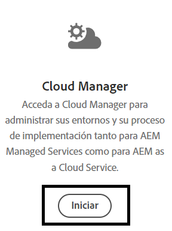
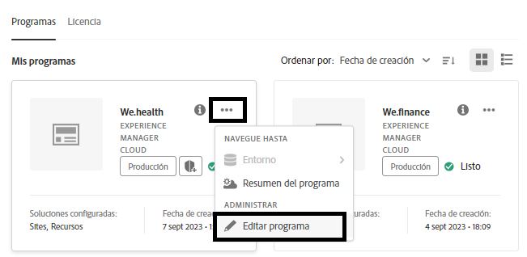
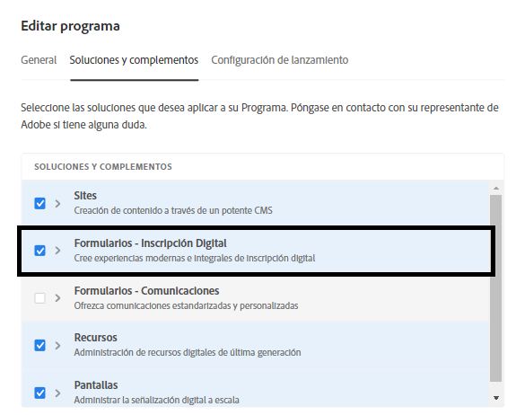
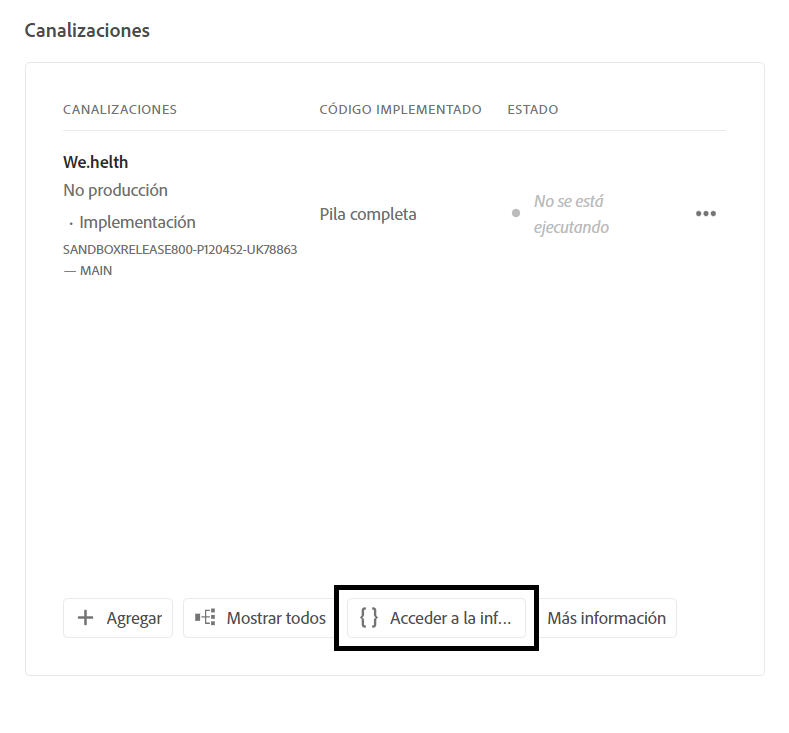
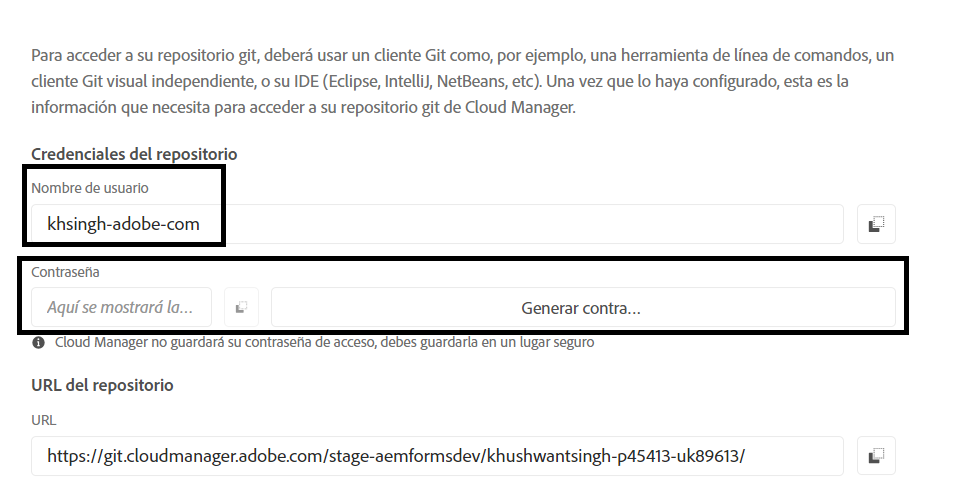
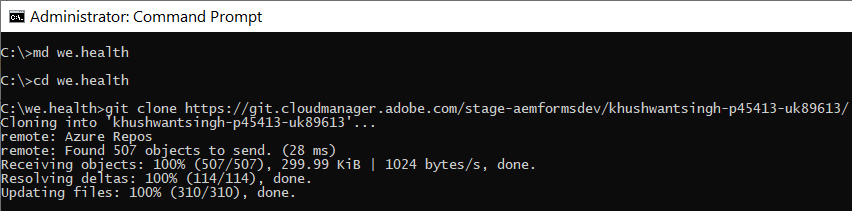
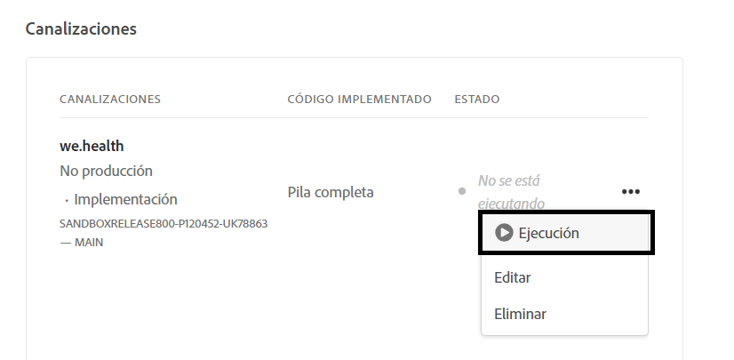

# Configuración de un entorno de desarrollo para formularios adaptables sin encabezado en Cloud Service

<span class="preview"> Este artículo está en **PROCESO DE TRABAJO**.</span>


¿Está listo para crear y probar formularios adaptables sin encabezado en Cloud Service? Habilite Formularios para su programa de Cloud Service y póngase en marcha.

## Antes de empezar

* Instale la [última versión de Git](https://git-scm.com/downloads) en su equipo local. Si no tiene experiencia previa con Git, consulte [Instalación de Git](https://git-scm.com/book/es/v2/Getting-Started-Installing-Git). El repositorio Git se utiliza para insertar los formularios y el código personalizado desarrollados en el entorno de desarrollo local, en el entorno de desarrollo de Cloud Service.

* Instale [Node.js 16.13.0 o una versión posterior](https://nodejs.org/es/download/) en su equipo local. <!-- URL IS 404! If you are new to Node.js, see [How to install Node.js](https://nodejs.org/en/learn/how-to-install-nodejs). -->


* Cree un programa AEM as a Cloud Service: siga los pasos del 1 al 7 del artículo [Crear un programa](https://experienceleague.adobe.com/es/docs/experience-manager-cloud-service/content/onboarding/demo-add-on/create-program#create-program) para crear un programa para su organización.

* Habilite el [canal de versiones preliminares para su programa de Cloud Service](https://experienceleague.adobe.com/es/docs/experience-manager-cloud-service/content/release-notes/prerelease#cloud-environments).

## Configuración del flujo de trabajo

Para habilitar formularios adaptables sin encabezado en la zona protegida de Forms as a Cloud Service, habilite la solución `Forms - Digital enrolment` para su programa de AEM Cloud Service. A continuación, cree un proyecto basado en el arquetipo 37 o posterior en su equipo local y envíelo al entorno de Forms as a Cloud Service. El proceso completo es el siguiente:



### &#x200B;1. Habilitar Forms para su programa

<table style="table-layout:auto">
<tr>
  <td>
  1. Inicie sesión en <a href="https://experience.adobe.com/" > https://experience.adobe.com/ </a> y seleccione la opción <b> Experience Manager </b>.
  </td>
  <td>
    <a href="https://experienceleague.adobe.com/es/docs/experience-manager-cloud-service/content/onboarding/demo-add-on/create-program#create-program">
      
    </a>
    <br>
  </td>
</tr>
<tr>
  <td>
  2. Para la opción <b>Cloud Manager</b>, haga clic en <b>Iniciar. </b> Aparecerá una lista de programas para su organización.
  </td>
  <td>
    <a href="https://experienceleague.adobe.com/es/docs/experience-manager-cloud-service/content/onboarding/demo-add-on/create-program#create-program">
      
    </a>
    <br>
  </td>
</tr>
<tr>
  <td>
    3. Para su programa, pulse el icono ... y seleccione la opción <b>Editar programa.</b>. Aparecerá un cuadro de diálogo. 
  </td>
  <td>
    <a href="https://experienceleague.adobe.com/es/docs/experience-manager-cloud-service/content/onboarding/demo-add-on/create-program#create-program">
      
    </a>
    <br>
  </td>
</tr>
<tr>
  <td>
    4. En el cuadro de diálogo Editar programa, vaya a la <b>pestaña Soluciones y complementos</b>, seleccione la opción <b>Forms - Inscripción digital</b> y pulse <b>Actualizar</b>. 
  </td>
  <td>
    <a href="https://experienceleague.adobe.com/es/docs/experience-manager-cloud-service/content/onboarding/demo-add-on/create-program#create-program">
      
    </a>
    <br>
  </td>
</tr>
</table>

### &#x200B;2. Clonar el repositorio Git del programa en su equipo local

Cada programa de AEM as a Cloud Service contiene un repositorio Git. Le permite cargar código personalizado y recursos desde el equipo local en su entorno de Cloud Service. Durante la configuración, Adobe utiliza el repositorio Git para llevar el código relacionado con los formularios adaptables sin encabezado, las plantillas y otra información a su programa Cloud Service desde el equipo local. Clonar el repositorio Git de Cloud Service en su equipo local es el primer paso para llevar el código y el contenido personalizados desde su equipo local a Cloud Service.

>[!INFO]
>
> Siempre puede realizar una confirmación en un repositorio de Git sin clonarlo. Pero, presenta sus propias peculiaridades. Por lo tanto, este documento va a usar el enfoque de clonación.


Para clonar el repositorio, haga lo siguiente:

<table style="table-layout:fixed">
<tr>
  <td>
  1. En el cuadro de canalización del programa, pulse <b>Acceder a la información del repositorio. </b> Aparecerá un cuadro de diálogo con información del repositorio 
  </td>
  <td>
    <a href="https://experienceleague.adobe.com/es/docs/experience-manager-cloud-service/content/onboarding/demo-add-on/create-program#create-program">
      
    </a>
    <br>
  </td>
</tr>
<tr>
  <td>
  2. Pulse <b>Generar contraseña</b> y copie la <b>URL del repositorio. </b> 
  </td>
  <td>
      
    <br>
  </td>
</tr>
<tr>
  <td>
    3. En su equipo local, abra el símbolo del sistema, cree una carpeta, ejecute el siguiente comando y proporcione las credenciales del repositorio, tal y como se solicita:
 </br>
 <code> git clone [Repository URL] </code> </br></br>
 Por ejemplo, </br> 
    <code> git clone https://git.cloudmanager.adobe.com/stage-aemformsdev/khushwantsingh-p45413-uk89613/ </code>

</br> Cuando se le pregunte, consiga el <b>Nombre de usuario</b> y la <b>Contraseña</b> desde la pantalla <b>Información del repositorio</b>.
</td>
  <td>
     
  </td>
</tr>
</table>


### &#x200B;3. Crear un proyecto basado en el arquetipo de AEM

El tipo de archivo del proyecto es una plantilla basada en Maven. Crea un proyecto mínimo basado en las prácticas recomendadas para empezar a utilizar formularios adaptables sin encabezado. También incluye la funcionalidad principal de formularios adaptables sin encabezado para Forms as a Cloud Service. Es obligatorio crear e implementar el proyecto basado en el arquetipo 37 o posterior.
®®®
Según el sistema operativo, ejecute el comando de Maven para crear un proyecto Experience Manager Forms as a Cloud Service. Utilice la versión 37 o posterior del arquetipo. Consulte [Documentación del arquetipo](https://experienceleague.adobe.com/es/docs/experience-manager-core-components/using/developing/archetype/overview) para encontrar la última versión del arquetipo.

+++ Microsoft® Windows

1. Abra el símbolo del sistema con privilegios administrativos (ejecute el símbolo del sistema o bash shell como administrador).
1. Ejecute el siguiente comando:

   ```shell
     mvn -B org.apache.maven.plugins:maven-archetype-plugin:3.2.1:generate ^
     -D archetypeGroupId=com.adobe.aem ^
     -D archetypeArtifactId=aem-project-archetype ^
     -D archetypeVersion=37 ^
     -D appTitle=myheadlessform ^
     -D appId=myheadlessform ^
     -D groupId=com.myheadlessform ^
     -D includeFormsenrollment="y" ^
     -D includeFormsheadless="y" 
   ```

™™™

* Establezca `appTitle` para definir el título y los grupos de componentes.
* Establezca `appId` para definir el artifactId de Maven, los nombres de carpetas de componentes, configuración y contenido y los nombres de bibliotecas de cliente.
* Establezca `groupId` para definir el groupId de Maven y el paquete fuente de Java™.
* Utilice la opción `includeFormsenrollment=y` para incluir configuraciones, temáticas, plantillas, componentes principales y dependencias específicos para formularios, que son necesarios para crear formularios adaptables.
* Utilice la opción `includeFormsheadless=y` para incluir los componentes principales de formularios y las dependencias necesarias para incluir la funcionalidad de formularios adaptables sin encabezado. Al habilitar esta opción, se incluyen las siguientes opciones:
   * La plantilla **En blanco con componentes principales** con [componentes principales](https://experienceleague.adobe.com/es/docs/experience-manager-core-components/using/introduction).
   * Un módulo de React de front-end, `ui.frontend.react.forms.af`. Le ayuda a procesar formularios adaptables sin encabezado en una aplicación de react.

+++®®®


+++ Apple macOS o Linux®

1. Abra el terminal como usuario raíz. Permite ejecutar comandos con privilegios administrativos. También puede utilizar `sudo root` después de abrir la ventana de terminal para ejecutar comandos con privilegios administrativos.
1. Ejecute el siguiente comando:

   ```shell
     mvn -B org.apache.maven.plugins:maven-archetype-plugin:3.2.1:generate \
     -D archetypeGroupId=com.adobe.aem \
     -D archetypeArtifactId=aem-project-archetype \
     -D archetypeVersion=37 \
     -D appTitle=myheadlessform \
     -D appId=myheadlessform \
     -D groupId=com.myheadlessform \
     -D includeFormsenrollment="y" \
     -D includeFormsheadless="y"  
   ```

™™™
* Establezca `appTitle` para definir el título y los grupos de componentes.
* Establezca `appId` para definir el artifactId de Maven, los nombres de carpetas de componentes, configuración y contenido, y los nombres de bibliotecas de cliente.
* Establezca `groupId` para definir el groupId de Maven y el paquete fuente de Java™.
* Utilice la opción `includeFormsenrollment=y` para incluir configuraciones, temáticas, plantillas, componentes principales y dependencias específicos para formularios, que son necesarios para crear formularios adaptables.
* Utilice la opción `includeFormsheadless=y` para incluir los componentes principales de formularios y las dependencias necesarias para incluir la funcionalidad de formularios adaptables sin encabezado. Al habilitar esta opción, se incluyen las siguientes opciones:
   * La plantilla **En blanco con componentes principales** con [componentes principales](https://experienceleague.adobe.com/es/docs/experience-manager-core-components/using/introduction).
   * Un módulo reacts de front-end, `ui.frontend.react.forms.af`. Le ayuda a procesar formularios adaptables sin encabezado en una aplicación de react.

+++

Al finalizar correctamente el comando, se creará una carpeta de proyecto con el nombre especificado en el `appID`. Por ejemplo, si utiliza `appID` con el valor `myheadlessform`, se creará una carpeta denominada `myheadlessform`. Contiene el proyecto basado en el arquetipo.

### &#x200B;4. Enviar el proyecto basado en el arquetipo de AEM a su entorno de Cloud Service

1. Reemplace el contenido del repositorio Git por contenido de un proyecto basado en el arquetipo.

   >[!VIDEO](https://video.tv.adobe.com/v/3409809/)

1. Abra el símbolo del sistema, vaya a la carpeta del repositorio Git y ejecute los siguientes comandos en el orden indicado para cargar el contenido reemplazado en el entorno de Cloud Service. También puede utilizar un editor visual en lugar de utilizar los siguientes comandos para insertar contenido en el repositorio de Cloud Service.

   ```
      git add .
      git commit
      git push origin
   ```

### &#x200B;5. Ejecutar una canalización de compilación para su programa


<table style="table-layout:auto">
<tr>
  <td>
  1. Inicie sesión en <a href="https://experience.adobe.com/" > https://experience.adobe.com/ </a> y seleccione la opción <b> Experience Manager </b>.
  </td>
  <td>
    <a href="https://experienceleague.adobe.com/es/docs/experience-manager-cloud-service/content/onboarding/demo-add-on/create-program#create-program">
      
    </a>
    <br>
  </td>
</tr>
<tr>
  <td>
  2. Para la opción <b> Cloud Manager </b>, haga clic <b> Iniciar. </b> Aparecerá una lista de programas para su organización. Abra el programa. 
  </td>
  <td>
    <a href="https://experienceleague.adobe.com/es/docs/experience-manager-cloud-service/content/onboarding/demo-add-on/create-program#create-program">
      
    </a>
    <br>
  </td>
</tr>
<tr>
  <td>
    3. Para la canalización, pulse el icono ... y seleccione la opción <b> Ejecutar </b>. Si se le solicita que ejecute la canalización, pulse <b> Ejecutar </b> y espere a que cambie el <b> estado </b> de la canalización a <b> Completado</b>.  
  </td>
  <td>
    <a href="https://experienceleague.adobe.com/es/docs/experience-manager-cloud-service/content/onboarding/demo-add-on/create-program#create-program">
      
    </a>
    <br>
  </td>
</tr>
</table>

Ahora, su entorno está listo para usar formularios adaptables sin encabezado. Ahora puede cargar una definición JSON de un formulario en su entorno de Cloud Service. A continuación, cree un formulario adaptable sin encabezado basado en él y use [getForm](https://opensource.adobe.com/aem-forms-af-runtime/api/#tag/Get-Form-Definition/operation/getForm) y otras API REST para usar el formulario adaptable sin encabezado en su aplicación o servicio.
